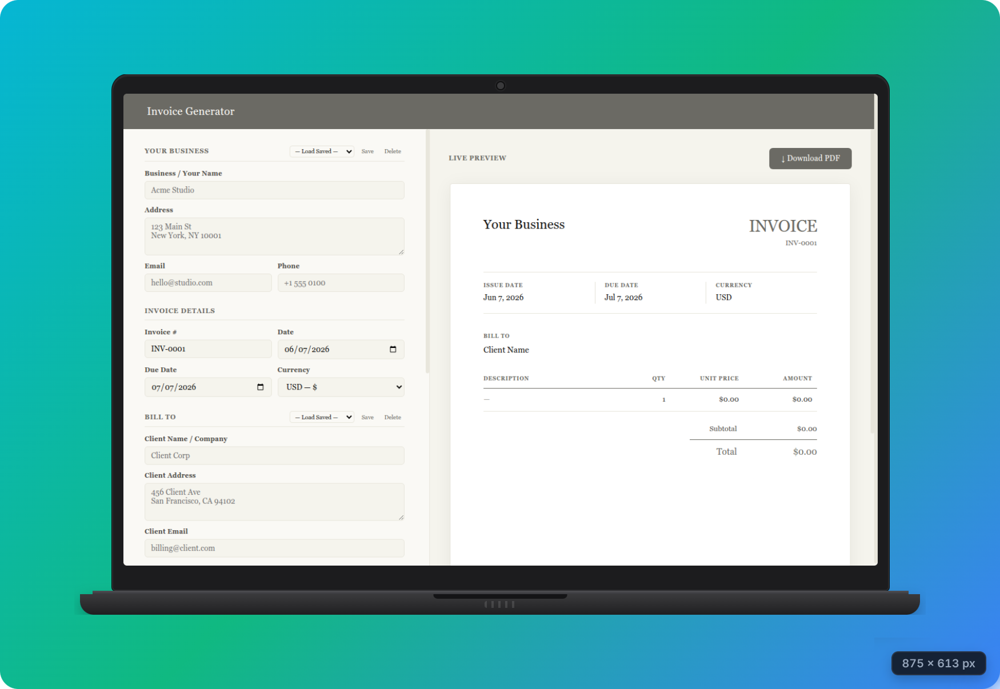

# Invofy — Simple Invoice Generator

Invofy is a lightweight, client-side invoice generator designed with a focus on editorial typography and minimal aesthetics.

👉 **[Live Demo](https://devded.github.io/invofy/)**

---

## ✨ Features

- **Live Preview**: Real-time rendering of your invoice sheet as you edit.
- **Local Profiles**: Save and load multiple business and client details in your browser (LocalStorage).
- **Offline First**: All calculations and profile data are handled 100% locally for absolute privacy.
- **Print to PDF**: A print-optimized layout stylesheet to save invoices perfectly on standard paper.

---

## 📜 Credits

- Designed with **Kami Design** principles.
